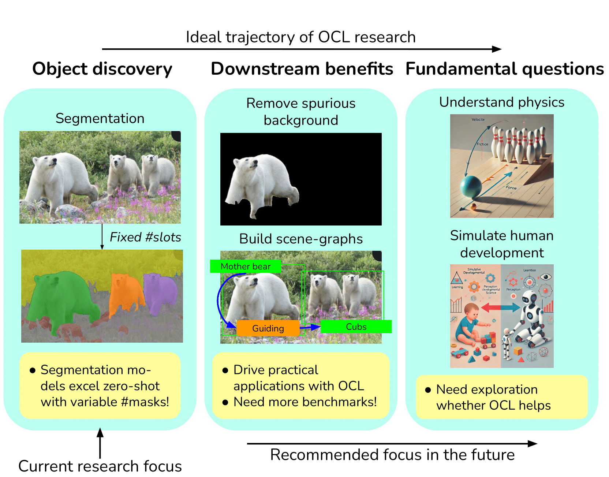

# Are We Done with Object-Centric Learning?



## Overview

This is an implementation of the paper [Are We Done with Object-Centric Learning?](https://arxiv.org/abs/2504.07092).

Object-centric learning (OCL) has focused on developing unsupervised mechanisms to separate the representation space into discrete slots. However, the inherent challenges of this task have led to comparatively less emphasis on exploring downstream applications, and exploring fundamental benefits. In our paper, we introduce simple, effective OCL mechanism - Object-Centric Classification with Applied Masks (OCCAM) to separate objects in pixel space and encode them independently. There are two main parts. The first part uses entity segmentation masks for object-centric representation generation. The second part performs robust classification by selecting representations corresponding to the foreground object and using them for classification.

We present a case study on the downstream benefits of OCCAM. It shows how object-centric representations from foundational segmentation models help reduce spurious correlations outperforming those from OCL methods.

The sections below has the following contents. In the section ["Installation"](#installation) we explain how to create a conda environment with all the necessary libraries. The section ["Download datasets and checkpoints"](#download-datasets-and-checkpoints) describe how to download datasets and models correspondingly. The section ["Evaluate on robust classification"](#evaluate-robust-classification) explains how to evaluate the models and reproduce the results for robust classification reported in the paper. The section ["Note about stuned.run_from_csv.py and .csv files"](#note-about-stunedrun_from_csvpy-and-csv-files) gives additional information about the scripts running pipeline we use in this repository.

Note: All commands are supposed to be run from the root of this repository and all paths are given relatively to it with occam conda environment activated.

## Installation

To create a python environment we use [anaconda](https://www.anaconda.com/).

To create and activate a conda environment with `Python 3.10.0` run the following commands:

```
mkdir ./envs && conda create --yes --prefix ./envs/occam python==3.10.0
conda activate ./envs/occam/
git submodule update --init --recursive
git submodule update --remote
pip install -r requirements.txt

# the commands below are needed only if you plan to generate masks with HQES.
# They require GCC 9+ for building detectron2
# as well as relevant `CUDA_HOME`, `LD_LIBRARY_PATH`, `CPATH`, `CFLAGS`,
# and `LDFLAGS` environment variables for compiling CUDA kernel
pip install git+https://github.com/facebookresearch/detectron2.git
cd occam/get_segments/modeling/pixel_decoder/ops/ && bash make.sh
```

## Reproduce results from the paper

To reproduce robust classification results please run this command:

```
python scripts/make_tables.py
```

It will parse the logs of the runs stored in the `experiments` folder
and generate tables with evaluation results matching the table names in the paper:

```
📦data
┗ 📂results
  ┗ 📂robust_classification
    ┣ 📜Table_2a.csv
    ┣ 📜Table_2b.csv
    ┣ 📜Table_2c.csv
    ┣ 📜Table_2d.csv
    ┣ 📜Table_3.csv
    ┣ 📜Table_4.csv
    ┗ 📜Table_5.csv
```

If you want to regenerate those logs yourself, you will need to follow the instructions
from the following sections (order matters):
["Download datasets and checkpoints"](#download-datasets-and-checkpoints),
["Generate masks"](#generate-masks),
["Evaluate robust classification"](#evaluate-robust-classification)

To plot the ROC-curves for OOD detection, please run all cells in sections `Imports`, `Functions` and `CLIP confidences` (order matters) of jupyter notebook `./notebooks/ood_det.ipynb`. It makes this plot by using precomputed Class-Aided, IoU and uncertainty scores stored in `data/results/ood_detection` and `data/results/uncertainty_scores`.

If you want to regenerate those scores, you will need to follow the same instructions
for robust classification results + instructions from ["Compute uncertainty scores"](#compute-uncertainty-scores) (order matters).

To get the qualitative results for HQES from Figure 1 (segmentation of image with bears) or Figure 3 please run all cells in sections `Imports`, `Functions`, `Predict with HQES` (order matters) in jupyter notebook `./notebooks/qualitative_results.ipynb`.

Please note that results may differ depending on the [CUDA](https://developer.nvidia.com/cuda-toolkit) version, the results above are computed for CUDA 12.2.

Note: Currently we provide only robust classification results.
Quantitative results for the object discovery (segmentation) experiments are currently not supported because they were computed using the [fork](https://github.com/AlexanderRubinstein/object-centric-learning-framework) ("train_works" branch) of the separate repository. We can add code and commands to reproduce other results by request if there are enough people interested.

## Download datasets and checkpoints

To download the datasets (6GB) and model checkpoints (2GB) needed for evaluation please run the following command (see ["Folder structure"](#folder-structure) for details of the resulting folders structure):

```
python scripts/download_datasets_and_checkpoints.py
```

Note: [ImageNet Validation](https://arxiv.org/abs/1409.0575) set is not downloaded automatically by the script above as it is too big, therefore you should manually download it (e.g. [from Kaggle](https://www.kaggle.com/code/joaoparana/download-imagenet-validation-set)) or symlink it to `data/datasets/ImageNet-val`. **Waterbirds** are sourced from this [Hugging Face dataset](https://huggingface.co/datasets/arubique/waterbirds), which we uploaded with permission from the original authors.

### Folder structure

Upon a successful completion of the script `scripts/download_datasets_and_checkpoints.py` `data` folder will be created and will have the following structure:

```
📦data
┗ 📂bboxes_annotations
┣ 📂datasets
┃ ┣ 📂CounterAnimal
┃ ┣ 📂Imagenet-9
┃ ┣ 📂Imagenet-D
┃ ┣ 📂UrbanCars
┃ ┗ 📂Waterbirds
┗ 📂results
```

In addition to that `checkpoints` folder will also be created and will have the following structure:

```
📦checkpoints
┗ 📜clip_l14_grit20m_fultune_2xe.pth
┗ 📜CropFormer_hornet_3x_03823a.pth
```

After following the steps from the section ["Generate masks"](#generate-masks) additional folders `masks` and `tars` will be created inside `data` folder, so that its resulting structure will be the following:

```
📦data
┗ 📂bboxes_annotations
┣ 📂datasets
┃ ┣ 📂CounterAnimal
┃ ┣ 📂Imagenet-9
┃ ┣ 📂Imagenet-D
┃ ┣ 📂UrbanCars
┃ ┗ 📂Waterbirds
┗ 📂results
┗ 📂masks
┗ 📂tars
```

## Generate masks

In this section we generate masks to compute outputs of the mask generator in OCCAM pipeline. Later we will use them for robust classification in ["Evaluate robust classification"](#evaluate-robust-classification).

Make sure that `data` and `checkpoints` folders have the structure described in ["Folder structure"](#folder-structure).

To generate the masks run the following command (see ["Note about stuned.run_from_csv.py and .csv files"](#note-about-stunedrun_from_csvpy-and-csv-files) for details):

```
export ROOT=./ && export ENV=$ROOT/envs/occam && export PROJECT_ROOT_PROVIDED_FOR_STUNED=$ROOT && conda activate $ENV && python -m stuned.run_from_csv --conda_env $ENV --csv_path $ROOT/sheets/mask_generation.csv --run_locally --n_groups 1
```

Upon a successful scripts completion `./sheets/mask_generation.csv` will look like `./sheets/mask_generation_filled.csv` and the file subfolders `masks` and `tars` will be created in `data` folder (see ["Folder structure"](#folder-structure) for details).

## Evaluate robust classification

In this section we evaluate OCCAM on out-of-distribution (OOD) image classification with spurious backgrounds.

Make sure that `data` and `checkpoints` folders have the structure described in ["Folder structure"](#folder-structure).

To evaluate the models run the command (see ["Note about stuned.run_from_csv.py and .csv files"](#note-about-stunedrun_from_csvpy-and-csv-files) for details):

```
export ROOT=./ && export ENV=$ROOT/envs/occam && export PROJECT_ROOT_PROVIDED_FOR_STUNED=$ROOT && conda activate $ENV && python -m stuned.run_from_csv --conda_env $ENV --csv_path $ROOT/sheets/robust_classification.csv --run_locally --n_groups 1
```

Upon a successful scripts completion `sheets/robust_classification.csv` will look like `sheets/robust_classification_filled.csv` and will be ready for steps described in [Reproduce results from the paper](#reproduce-results-from-the-paper).

## Take a look at masks applied to images

To visualize the images with applied masks for robust classification and foreground detection datasets, please see this [README](web_pipelines/show_dataset/README.md).

## Compute uncertainty scores

In pre-compute scores needed for reproducing the OOD detection results.

Make sure that `data` and `checkpoints` folders have the structure described in ["Folder structure"](#folder-structure).

To evaluate the models run the command (see ["Note about stuned.run_from_csv.py and .csv files"](#note-about-stunedrun_from_csvpy-and-csv-files) for details):

```
export ROOT=./ && export ENV=$ROOT/envs/occam && export PROJECT_ROOT_PROVIDED_FOR_STUNED=$ROOT && conda activate $ENV && python -m stuned.run_from_csv --conda_env $ENV --csv_path $ROOT/sheets/compute_uncertainty.csv --run_locally --n_groups 1
```

Upon a successful scripts completion `sheets/compute_uncertainty.csv` will look like `sheets/compute_uncertainty_filled.csv` and will be ready for steps described in [Reproduce results from the paper](#reproduce-results-from-the-paper).

## Note about stuned.run_from_csv.py and .csv files

.csv files are created for compact scripts running and logs recording using separate repository [STAI-tuned](https://github.com/AlexanderRubinstein/STAI-tuned). To run the scrips from the .csv file it should be submitted by the commands specified in the relevant sections, such as e.g:

```
export ROOT=./ && export ENV=$ROOT/envs/diverse_universe && export PROJECT_ROOT_PROVIDED_FOR_STUNED=$ROOT && conda activate $ENV && python -m stuned.run_from_csv --conda_env $ENV --csv_path $ROOT/result_sheets/evaluation.csv --run_locally --n_groups 1
```

### .csv file structure

- Each line of a .csv file corresponds to one run of the script written in the column "path_to_main".
- The script from the "path_to_main" column is parametrized by the config file specified in the column "path_to_default_config".
- The config from the "path_to_default_config" column is modified by the columns that start with keyword "delta:<...>".

### "n_groups" argument

`--n_groups k` means that `k` lines will be running at a time.

### logs

The logs from running each row (more precisely, the script in this row) are stored in the `stderr.txt` and `stdout.txt` files inside the folder specified in the "run_folder" column which will be automatically generated after submitting a .csv file.

### "whether_to_run" column

"whether_to_run" column can be modified to select the rows to run. After the .csv file submission only the rows that had `1` in this column are executed.
Whenever a script from some row successfully completes the corresponding value in the column "whether_to_run" changes from `1` to `0`. To rerun the same script 0 should be changed to 1 again.

### "status" column

Immediately after the .csv file submission for the rows that are being run a "status" column will be created (if it does not exist) with the value `Submitted` in it. Once corresponding sripts start running the "status" value will change to `Running`. Once the script completes status will become `Complete`. If the script fails its status will be `Fail`.

If something does not allow the script to start the status can be stuck with `Submitted` value. In that case please check the submission log file which is by default in `tmp/tmp_log_for_run_from_csv.out`.

## Citation

Please cite our paper if you use OCCAM in your work:

```
@misc{rubinstein2025objectcentriclearning,
      title={Are We Done with Object-Centric Learning?},
      author={
        Alexander Rubinstein and
        Ameya Prabhu and
        Matthias Bethge and
        Seong Joon Oh
      },
      year={2025},
      eprint={2504.07092},
      archivePrefix={arXiv},
      primaryClass={cs.CV},
      url={https://arxiv.org/abs/2504.07092},
}
```
