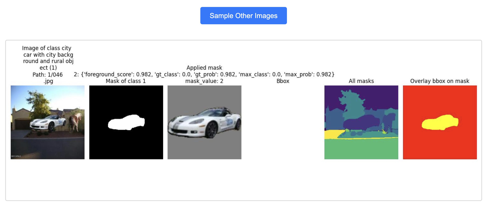
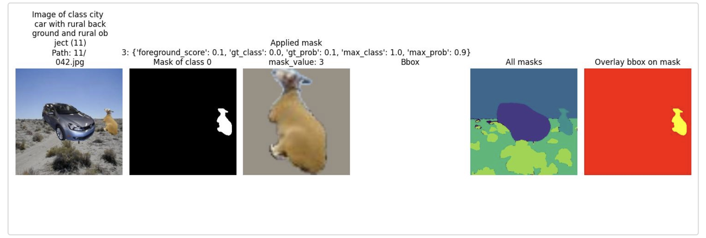

# Dataset Visualization Tool

A web-based visualization tool for exploring images with segmentation masks and bounding boxes from various datasets. This tool provides an interactive interface to view and analyze dataset samples with their associated metadata.

## Features

- **Interactive Web Interface**: Clean, responsive web interface for browsing dataset samples
- **Multi-View Visualization**: Display original images, segmentation masks, bounding boxes, and applied masks
- **Metadata Display**: Show classification labels, predictions, and other relevant metadata
- **Random Sampling**: Generate new random samples from the dataset with a single click
- **Multiple Dataset Support**: Compatible with various datasets including [Urban Cars](https://arxiv.org/abs/2212.04825), [Waterbirds](https://arxiv.org/abs/1911.08731), [ImageNet-D](https://arxiv.org/abs/2403.18775), [ImageNet-9](https://arxiv.org/abs/2006.09994), and [Counter Animal](https://arxiv.org/abs/2403.11497) datasets
- **Flexible Configuration**: Support for custom dataset configurations and parameters

## Prerequisites

Before using this tool, ensure you have:

1. **Python 3.10+** installed
2. **Required dependencies** installed (see Installation section)
3. **Dataset files** in the expected format (parquet files with segmentation data)
4. **Label converter files** (`.pt` files) for proper class name mapping

## Installation

1. Install the main project dependencies:
```bash
pip install -r requirements.txt
```

2. The tool requires the following key dependencies:
   - Flask (for web interface)
   - PyTorch (for data loading)
   - Matplotlib (for image visualization)
   - NumPy (for array operations)

## Usage

### Basic Usage

0. **Prepare file with dataset metadata and image/masks paths**
You need a parquet file with dataset metadata and image/mask paths for the `csv_path` config parameter, as mentioned in [here](#dataset-config-explanation)

**Example: generate masks for UrbanCars with [HQES](https://arxiv.org/abs/2211.05776) segmentation model:**
```bash
python ./scripts/predict_masks.py --confidence_threshold=0.5 --config_file=./configs/cropformer/cropformer_hornet.yaml --input_folder=./data/datasets/UrbanCars/test --mask_generator_type=cropformer --model_path=./checkpoints/CropFormer_hornet_3x_03823a.pth --output=./data/masks/cropformer/UC_masks.pkl
```

**Example: create metadata file using clip models to compute foreground detection scores:**
```bash
python ./scripts/eval_spurious.py --dataset_name=urban_cars --filter_keyword=by_mask_size+by_background+by_num_connected_components --mask_source=cropformer --result_path=./data/results/eval_spurious/uc_clip_cropformer.pkl --recompute_all --clip --skip_eval
```

This generates `./data/csvs/cropformer/source_urban_cars_by_mask_size+by_background+by_num_connected_components.parquet`.

`--filter_keyword` can control masks filtering as described in [here](#dataset-config-explanation).

1. **Start the web application**:
```bash
python ./web_pipelines/show_dataset/app.py --config_path ./configs/show_dataset/data_config.yaml --path_within_config data/dataset_configs/bboxed_dataset_urban_cars
```

2. **Open your web browser** and navigate to `http://localhost:5000`

3. **View the dataset samples** - The interface will display random samples from your dataset

For the example commands shown in step 0. you should see the following samples from [UrbanCars](https://openaccess.thecvf.com/content/CVPR2023/supplemental/Li_A_Whac-a-Mole_Dilemma_CVPR_2023_supplemental.pdf) dataset:



The example image shows 6 views from left to right:

1. Original image with filename and label (e.g. "city car on city background")

2. Foreground mask with highest foreground score. It's class will always be 1 - foreground. Below we will also show how to look at masks that are predicted as class 0 - background.

3. Applied mask on gray background, used in experiments. Includes metadata:
   - foreground_score: foreground selection score (in the example we use oracle foreground selection which is the same ground truth probability)
   - gt_class: Ground truth class label (e.g. 0 for city car)
   - gt_prob: Ground truth class probability
   - max_prob: Highest class probability (in the example it coincides with gt_prob because foreground detector predicts ground truth class)

4. Bounding box of foreground object (if available, otherwise full image box)

5. All detected masks from mask generator

6. Overlay of mask and bounding box (intersection in yellow), useful for IoU-based foreground selection

To view background masks (mask class 0) in addition to foreground masks (mask class 1), add the `dataset_task=detection` argument:

```python ./web_pipelines/show_dataset/app.py --config_path ./configs/show_dataset/data_config.yaml --path_within_config data/
dataset_configs/bboxed_dataset_urban_cars --data_kwargs dataset_task=detection --split eval
```

You will see examples like this one:



4. **Generate new samples** - Click the "Sample Other Images" button to get new random samples (image sampling can take up to 30 seconds if it is the first time you push the button)

### Dataset config explanation:

The `data_config.yaml` file defines multiple dataset configurations for the visualization tool. Each dataset configuration includes the following key parameters:

- **`train_transform`**: Image transforms applied during training (typically `null` for visualization)
- **`eval_transform`**: Image transforms for evaluation/visualization, including:
  - `ToTensor`: Converts images to PyTorch tensors
  - `Normalize`: Standard ImageNet normalization (mean: [0.485, 0.456, 0.406], std: [0.229, 0.224, 0.225])
- **`train_val_split`**: Fraction of data used for training (0.0 means all data used for evaluation)
- **`csv_path`**: Path to the csv or parquet file containing dataset metadata and image paths
- **`dataset_task`**: Either "classification" or "detection" - determines which masks are displayed
- **`label_converter`**: Path to `.pt` file containing class name mappings (or `null` if not needed)
- **`foreground_keyword`**: Keyword for foreground selection method (e.g., "oracle---clip_openai_ViT-L/14" means using ground truth probability (oracle in paper) of the clip from openai with ViT-L/14 vision encoder)
- **`filter_keyword`**: Filtering criteria for mask selection. If masks satisfy this criterion, they will be shown neither for classification nor for the detection task. Example: "by_mask_size+by_background+by_num_connected_components" filters masks based on size, image edges coverage, and number of connected components.

The config includes 6 pre-configured datasets:
1. **Urban Cars** (`bboxed_dataset_urban_cars`) - StanfordCars on city/rural backgrounds with city/rural co-occurring objects dataset
2. **Waterbirds Group 2** (`bboxed_dataset_wb_group_2`) - Waterbirds on land background
3. **Waterbirds Group 3** (`bboxed_dataset_wb_group_3`) - Waterbirds on water background
4. **ImageNet-D** (`bboxed_dataset_in_d`) - ImageNet-D background dataset
5. **ImageNet-9** (`bboxed_dataset_in_9`) - ImageNet-9 mixed dataset
6. **Counter Animal** (`bboxed_dataset_counter`) - Counter animal dataset

### Advanced Usage

#### Command Line Options

```bash
python ./web_pipelines/show_dataset/app.py --help
```

**Required Arguments:**
- `--config_path`: Path to the YAML configuration file containing dataset descriptions. Example config is here: `./configs/show_dataset/data_config.yaml`.
- `--path_within_config`: Path to the specific dataset configuration within the config file (e.g., `data/dataset_configs/bboxed_dataset_urban_cars`)

**Optional Arguments:**
- `--images_list`: Comma-separated list of specific image names to show (instead of the full name you can pass substrings of full names)
- `--split`: Data split to show (default: "train")
- `--n_images`: Number of images to display (default: 10)
- `--data_kwargs`: Additional keyword arguments for data configuration (format: `key1=value1;key2=value2`)
- `--debug`: Run in debug mode

#### Example Commands

**View Urban Cars dataset:**
```bash
python ./web_pipelines/show_dataset/app.py --config_path ./configs/show_dataset/data_config.yaml --path_within_config data/dataset_configs/bboxed_dataset_urban_cars
```

**View specific number of images:**
```bash
python ./web_pipelines/show_dataset/app.py --config_path ./configs/show_dataset/data_config.yaml --n_images 20
```

**View specific images:**
```bash
python ./web_pipelines/show_dataset/app.py --config_path ./configs/show_dataset/data_config.yaml --images_list "image1.jpg,image2.jpg,image3.jpg"
```

**View with custom parameters:**
```bash
python ./web_pipelines/show_dataset/app.py --config_path ./configs/show_dataset/data_config.yaml --data_kwargs "visualization_mode=unicorn;extended_output=true"
```

## Configuration

### Dataset Configuration

The tool uses YAML configuration files to define datasets. Each dataset configuration should include:

```yaml
dataset_name:
  train_transform: null
  eval_transform: <...> # Transform configuration
  train_val_split: 0.0
  csv_path: "./path/to/dataset.parquet"
  dataset_task: "classification"
  label_converter: "./path/to/label_converter.pt"
  foreground_keyword: "optional_keyword"
```

### Supported Datasets

The tool supports several pre-configured datasets:

1. **Urban Cars** (`bboxed_dataset_urban_cars`)
2. **Waterbirds Group 2** (`bboxed_dataset_wb_group_2`) - Waterbirds on land background
3. **Waterbirds Group 3** (`bboxed_dataset_wb_group_3`) - Waterbirds on water background
4. **ImageNet-D** (`bboxed_dataset_in_d`)
5. **ImageNet-9** (`bboxed_dataset_in_9`)
6. **Counter Animal** (`bboxed_dataset_counter`)

## Visualization Modes

### Standard Mode (Default)
Displays:
- Original image with class information
- Segmentation mask
- Applied mask with metadata
- Bounding box
- All masks (if available)
- Overlay of bounding box on mask

### Unicorn Mode
A simplified view showing:
- Original image
- Segmentation mask
- Applied mask with metadata
- All masks (if available)

To use unicorn mode, add `visualization_mode: unicorn` to your dataset configuration.

## Output Format

Each displayed image shows multiple views in a grid layout:

1. **Original Image**: The source image with class label and file path
2. **Segmentation Mask**: The segmentation mask for the main object
3. **Applied Mask**: The mask applied to the image with metadata (predictions, scores, etc.)
4. **Bounding Box**: The bounding box annotation
5. **All Masks**: Combined view of all available masks (if multiple masks exist)
6. **Overlay**: Bounding box overlaid on the segmentation mask

## File Structure

```
web_pipelines/show_dataset/
├── app.py                 # Main Flask application
├── templates/
│   └── index.html        # Web interface template
├── static/
│   └── images/           # Generated visualization images (auto-created)
└── README.md            # This file
```

## Troubleshooting

### Common Issues

1. **"Dataset is empty" error**: Ensure your dataset files exist and contain valid data
2. **Label converter not found**: Verify the path to your `.pt` label converter files
3. **Images not displaying**: Check that the `static/images/` directory is writable
4. **Port already in use**: The default port is 5000. If busy, Flask will automatically use the next available port

### Debug Mode

Run with `--debug` flag to enable Flask's debug mode:
```bash
python ./web_pipelines/show_dataset/app.py --config_path ./configs/show_dataset/data_config.yaml --debug
```

## Technical Details

- **Framework**: Flask web application
- **Image Processing**: Matplotlib for visualization, PyTorch for data loading
- **Data Format**: Supports parquet files with extended bboxed dataset format
- **Image Storage**: Generated visualizations are temporarily stored in `static/images/`
- **Sampling**: Uses uniform random sampling to select dataset items

